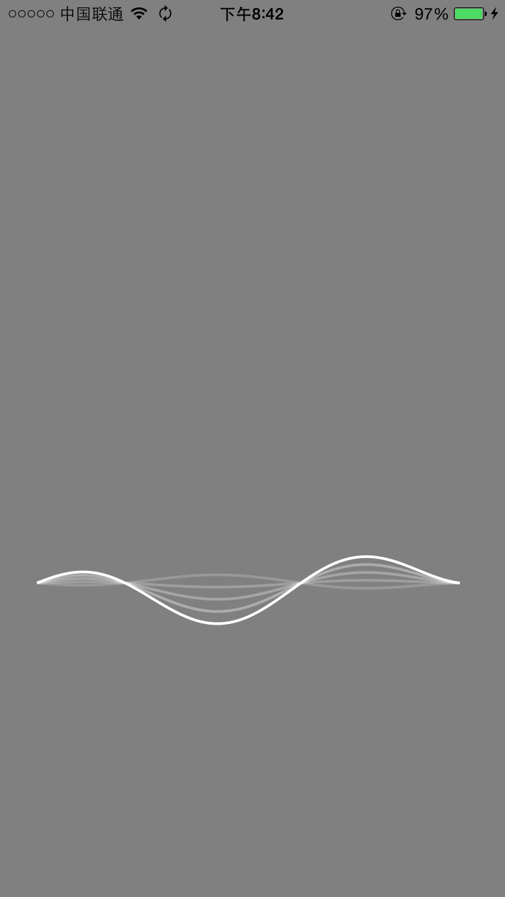

swift-Wave
==========

just a practise for swift.
[Origin Objective-c implement](https://github.com/kevinzhow/Waver) 


A Siri like wave effect

[](siri-wave.mov)

###usage
1.add Waver.swift to your project

2.use it like this

```swift

        let waver = Wave(frame: CGRectMake(0, 0, 320, 200))
        
        weak var weakWaver = waver;
        
        waver.setWaverLevelCallback( { () -> () in
            self.recorder?.updateMeters()
            let normalizedValue = pow (10, self.recorder!.averagePowerForChannel(0) / 40);
            weakWaver!.level    = CGFloat(normalizedValue)
        })
        
 ```
      
